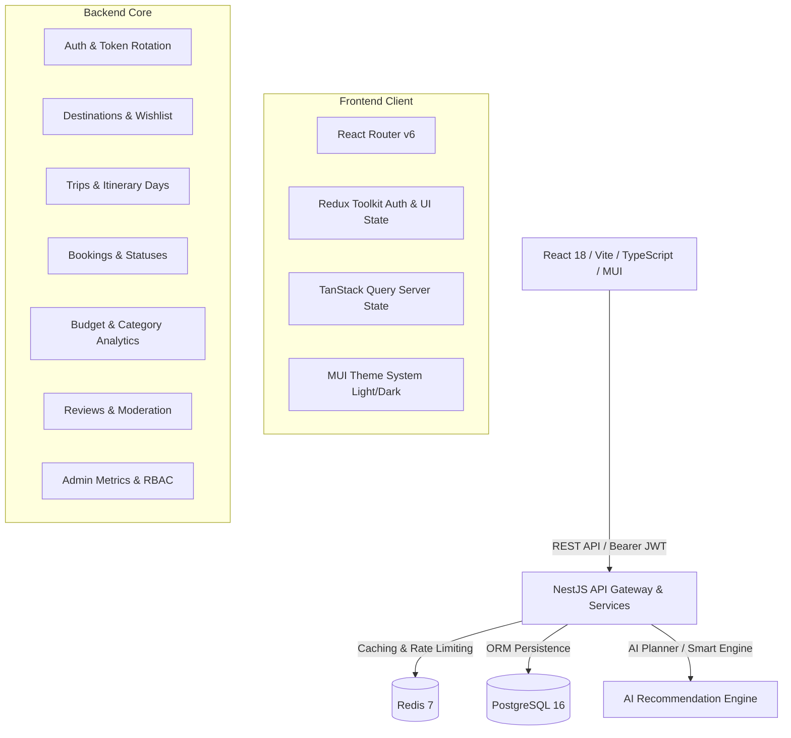

# 🌍 WanderWise - Enterprise Travel Assistance Web Application

> A production-grade, full-stack travel discovery, itinerary planning, expense tracking, booking management, and AI-assisted travel platform built with **React**, **TypeScript**, **Material UI (MUI)**, **Redux Toolkit**, **TanStack Query**, **NestJS**, **TypeORM**, **PostgreSQL**, and **Redis**.

---

## 📌 Table of Contents

1. [Architecture & System Overview](#-architecture--system-overview)
2. [Key Features](#-key-features)
3. [Tech Stack](#-tech-stack)
4. [Project Structure](#-project-structure)
5. [Prerequisites](#-prerequisites)
6. [Quickstart with Docker Compose](#-quickstart-with-docker-compose)
7. [Manual Local Setup](#-manual-local-setup)
   - [1. Backend Setup](#1-backend-setup)
   - [2. Database Seeding](#2-database-seeding)
   - [3. Frontend Setup](#3-frontend-setup)
8. [Default Demo Credentials](#-default-demo-credentials)
9. [API Documentation (Swagger)](#-api-documentation-swagger)
10. [AI Travel Assistant Capabilities](#-ai-travel-assistant-capabilities)
11. [Testing & Quality Assurance](#-testing--quality-assurance)
12. [Deployment Guide](#-deployment-guide)

---

## 🏗 Architecture & System Overview



---

## ✨ Key Features

### 🔐 1. Authentication & Role-Based Access Control (RBAC)
- Full JWT authentication with access token & automatic refresh-token rotation on `401 Unauthorized`.
- Roles: `USER`, `ADMIN`.
- Forgot & Reset password workflows with secure token expiration.
- User profile management (name, avatar, phone, bio, preferred travel style, preferred currency).

### 🏖 2. Destination Discovery & Wishlist
- Multi-filter catalog search by keyword, country, category (Beach, Mountain, Cultural, Heritage, Adventure, Urban), travel style, and price range.
- Pagination, sorting (rating, cost, popularity), and curated image galleries.
- Comprehensive destination detail pages: Best time to visit, weather notes, estimated daily budget, top attractions, recommended activities, and community reviews.
- Wishlist / Bookmark system for registered users.

### 🗺 3. Trip & Day-by-Day Itinerary Planner
- Create and organize trips with custom date ranges, target budgets, travel styles, and statuses (`PLANNING`, `CONFIRMED`, `ONGOING`, `COMPLETED`, `CANCELLED`).
- Day-by-day itinerary builder: Add schedule items, set start/end times, activity types, estimated costs, transit notes, and toggle item completion.
- Interactive budget progress tracking and schedule reordering.

### ✈️ 4. Bookings & Reservations Hub
- Manage bookings across Flights, Hotels, Trains, Buses, Car Rentals, and Activities.
- Track confirmation reference numbers, provider details, check-in / departure times, and payment statuses (`PENDING`, `CONFIRMED`, `CANCELLED`).

### 📊 5. Expense Tracker & Budget Breakdown
- Real-time expense logging linked to specific trips.
- Categorized spending (Transportation, Accommodation, Food & Dining, Activities, Shopping, Miscellaneous).
- Visual budget consumption meter with alerts when approaching or exceeding limits.

### 🤖 6. AI Travel Assistant
- Conversational travel concierge with pre-built prompt shortcuts:
  - *3-day weekend itinerary in Goa*
  - *Budget backpacking in Kerala*
  - *Heritage & cultural tour in Jaipur*
  - *Essential packing checklist*
  - *Weekend getaways near Mumbai*
- **One-Click Itinerary Export**: Turn any generated AI itinerary directly into an editable user trip in your dashboard with pre-filled days, activities, and budget estimates.

### 🛡 7. Admin Control Panel
- System statistics (total users, active trips, destinations, booking counts, revenue).
- User management (role updates, account activation/deactivation).
- Destination catalog CRUD with dynamic activities and photo galleries.
- Review moderation (approve, flag, or delete user reviews).

---

## 💻 Tech Stack

### Frontend
- **React 18** with **TypeScript** (Strict Mode)
- **Vite** for fast HMR and optimized bundling
- **Material UI (MUI v6)** with tailored Light/Dark Ocean & Sunset theme palettes
- **Redux Toolkit** for authentication, theme, and persistent global client state
- **TanStack Query (React Query v5)** for server state caching, pagination, and optimistic updates
- **Formik & Yup** for validated forms
- **Axios** with automatic token refresh queue interceptors
- **Dayjs** for date calculations and formatting

### Backend
- **Node.js (v20+)** & **NestJS 10**
- **TypeORM** with **PostgreSQL 16**
- **Redis 7** for caching and session rate-limiting
- **Passport.js & JWT** with Argon2 / bcrypt hashing
- **Class-Validator & Class-Transformer** for request DTO validation
- **Swagger / OpenAPI 3.0** documentation

---

## 📁 Project Structure

```text
TravelAssistance/
├── backend/                  # NestJS Backend API
│   ├── src/
│   │   ├── admin/            # Admin metrics & moderation
│   │   ├── assistant/        # AI travel planner & smart engine
│   │   ├── auth/             # JWT auth, refresh rotation, guards
│   │   ├── bookings/         # Bookings & reservation management
│   │   ├── common/           # Decorators, filters, interceptors
│   │   ├── config/           # Environment & database config
│   │   ├── database/         # TypeORM entities & database seeders
│   │   ├── destinations/     # Destinations, wishlist & activities
│   │   ├── expenses/         # Trip expenses & budget calculations
│   │   ├── itineraries/      # Day-by-day itinerary planner
│   │   ├── notifications/    # In-app notifications
│   │   ├── reviews/          # Destination reviews & ratings
│   │   ├── trips/            # Trip lifecycle management
│   │   ├── users/            # User & profile entities
│   │   ├── app.module.ts     # Root application module
│   │   └── main.ts           # Application entry point & Swagger
│   ├── test/                 # E2E & unit tests
│   ├── Dockerfile
│   └── package.json
│
├── frontend/                 # React + Vite + TypeScript Frontend
│   ├── src/
│   │   ├── app/              # MUI theme system & design tokens
│   │   ├── components/       # Reusable UI components (Buttons, Inputs, Modals, StatsCard, etc.)
│   │   ├── features/         # Feature modules
│   │   │   ├── admin/        # Admin dashboard & management pages
│   │   │   ├── assistant/    # AI travel concierge & chat widget
│   │   │   ├── auth/         # Login, Register, Password Reset
│   │   │   ├── bookings/     # Bookings management
│   │   │   ├── dashboard/    # User overview dashboard
│   │   │   ├── destinations/ # Discovery, Detail & Saved pages
│   │   │   ├── expenses/     # Expense tracker
│   │   │   ├── notifications/# Notifications list
│   │   │   ├── profile/      # User profile & settings
│   │   │   └── trips/        # Trips & Itinerary planner
│   │   ├── layouts/          # RootLayout, MainLayout, AuthLayout, AdminLayout
│   │   ├── routes/           # AppRoutes, ProtectedRoute, AdminRoute
│   │   ├── services/         # Axios API client & interceptors
│   │   ├── store/            # Redux store & slices (auth, theme, ui)
│   │   └── types/            # TypeScript interfaces & enums
│   ├── Dockerfile
│   ├── nginx.conf
│   └── package.json
│
├── .github/workflows/ci.yml  # Automated CI build & test pipeline
├── docker-compose.yml        # Multi-container orchestration (DB + Redis + API + UI)
├── render.yaml               # Cloud deployment blueprint
└── README.md
```

---

## ⚙️ Prerequisites

- **Node.js**: `v20.x` or `v22.x` / `v24.x`
- **npm**: `v10.x+`
- **Docker & Docker Compose** (optional, for containerized run)
- **PostgreSQL 16** & **Redis 7** (if running locally without Docker)

---

## 🚀 Quickstart with Docker Compose

The fastest way to launch the complete system (PostgreSQL + Redis + NestJS Backend + React/Nginx Frontend):

```bash
# Clone the repository
git clone <repo-url>
cd TravelAssistance

# Build and start all services in detached mode
docker compose up --build -d
```

### Access URLs:
- **Frontend Web Application**: [http://localhost:3000](http://localhost:3000)
- **Backend API**: [http://localhost:5000/api](http://localhost:5000/api)
- **Interactive Swagger API Docs**: [http://localhost:5000/api/docs](http://localhost:5000/api/docs)

To shut down:
```bash
docker compose down
```

---

## 🛠 Manual Local Setup

### 1. Backend Setup

```bash
cd backend

# Install dependencies
npm install

# Setup environment variables
cp .env.example .env
# Update .env with your local PostgreSQL and Redis credentials

# Build backend
npm run build

# Run unit tests
npm test

# Start in development mode (with hot-reload)
npm run start:dev
```
The backend will run on `http://localhost:5000`.

### 2. Database Seeding

Populate the database with sample destinations (Goa, Kerala, Jaipur, Paris, Tokyo, Bali), demo trips, bookings, expenses, and user accounts:

```bash
cd backend
npm run seed
```

### 3. Frontend Setup

```bash
cd frontend

# Install dependencies
npm install

# Setup environment variables
cp .env.example .env

# Start Vite development server
npm run dev
```
The frontend will run on `http://localhost:5173`.

---

## 🔑 Default Demo Credentials

Once the seed script runs or Docker containers initialize:

| Role | Email | Password | Access Level |
| :--- | :--- | :--- | :--- |
| **Admin** | `admin@travelassistance.com` | `Admin@123456` | Full Admin Console, Metrics, Catalog & Review Moderation |
| **User** | `traveler@example.com` | `User@123456` | Trip Planner, AI Assistant, Bookings, Expenses |

---

## 📖 API Documentation (Swagger)

NestJS automatically generates interactive OpenAPI/Swagger documentation.
Visit: **`http://localhost:5000/api/docs`**

Key Endpoints include:
- `POST /api/auth/register` & `POST /api/auth/login`
- `POST /api/auth/refresh-token` & `POST /api/auth/logout`
- `GET /api/destinations` (Search, filters, pagination)
- `GET /api/destinations/:id` & `POST /api/destinations/:id/save`
- `GET /api/trips`, `POST /api/trips`, `GET /api/trips/:id`
- `POST /api/trips/:id/itinerary/days/:dayId/items`
- `GET /api/bookings` & `POST /api/bookings`
- `GET /api/expenses` & `POST /api/expenses`
- `POST /api/assistant/chat` & `POST /api/assistant/generate-itinerary`
- `GET /api/admin/metrics`, `GET /api/admin/users`, `GET /api/admin/reviews`

---

## 🤖 AI Travel Assistant Capabilities

The AI Travel Concierge (`/assistant` or floating widget) provides:
1. **Intelligent Destination Suggestions**: Recommends destinations based on budget, travel style, and duration.
2. **Dynamic Day-by-Day Generation**: Generates full morning/afternoon/evening itineraries with estimated activity costs and transportation advice.
3. **Budget Planner**: Calculates realistic budget breakdowns for solo, couple, or family trips.
4. **Packing & Essentials Assistant**: Generates customized packing checklists tailored to destination climate and activities.
5. **Direct Dashboard Integration**: Click **"Save to My Trips"** on any generated AI itinerary to convert it into a fully editable trip in your account.

---

## 🧪 Testing & Quality Assurance

### Backend Unit Tests
```bash
cd backend
npm test
```
*Executes unit test suites for Destinations, AI Assistant, and Authentication services.*

### Frontend TypeScript Compilation & Build Validation
```bash
cd frontend
npm run build
```
*Validates type safety and compiles the production bundle.*

---

## ☁️ Deployment Guide

### Deploying to Render via `render.yaml`
1. Connect this repository to your **Render** dashboard.
2. Select **New Blueprint Instance**.
3. Render will automatically provision:
   - PostgreSQL Database
   - Redis Instance
   - Backend Web Service (Docker runtime)
   - Frontend Static / Web Service (Nginx runtime)

### Continuous Integration (CI)
GitHub Actions workflow is configured in `.github/workflows/ci.yml`. On every push and pull request to `main` or `master`, it automatically:
1. Builds and runs unit tests on the NestJS backend.
2. Type-checks and builds the React frontend production bundle.

---

## 📄 License
This project is open-source software licensed under the **MIT License**.
